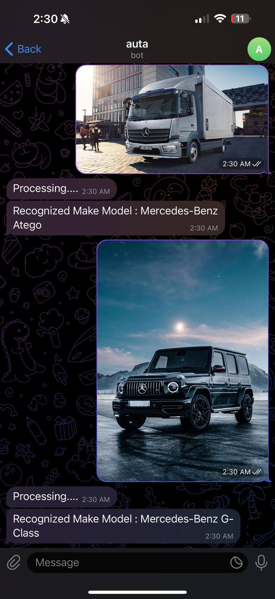
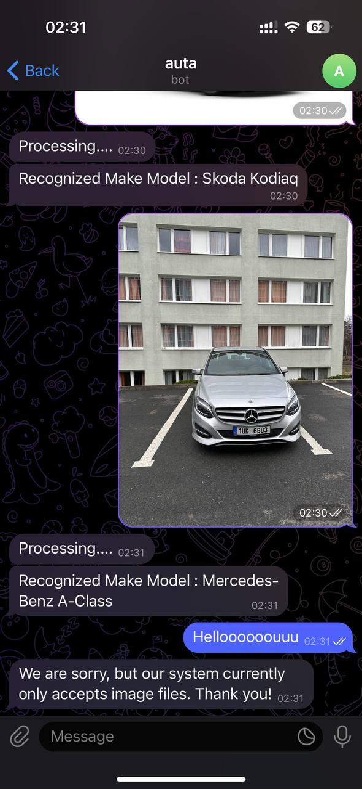
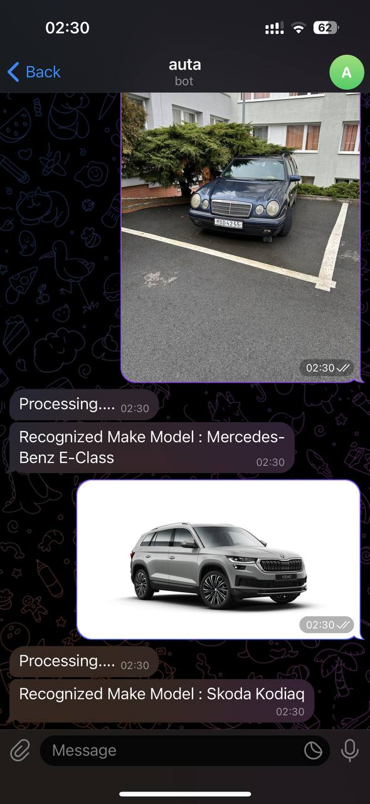
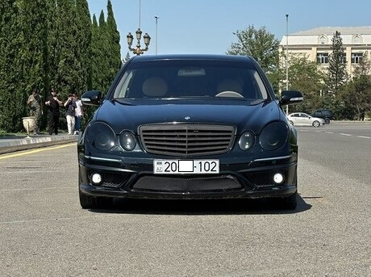
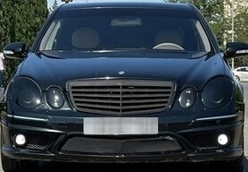
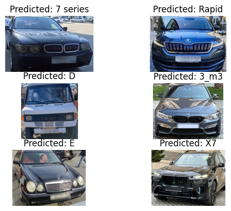

# auta
<br/>

<div style="display: flex;">
  
  
  
</div>


## Car Make and Model Recognition Telegram Bot

This project consists of a Telegram bot that predicts the make and model of cars from images sent via the Telegram app. The bot utilizes a custom-trained model to perform the recognition.

## Project Structure

The project is organized as follows:

1. [Folder_Reordering](Folder_Reordering): Contains scripts for preprocessing the data collected from a car selling website. This includes organizing images into folders based on make and model, and merging similar folders.
    - [copy_subfolders.py](Folder_Reordering/copy_subfolders.py): Python script to copy subfolders into a single folder.
    - [single_image_deleter.py](Folder_Reordering/single_image_deleter.py): Python script to delete subfolders containing only a single image.
    - [merge_folders.py](Folder_Reordering/merge_folders.py): Python script to merge similar folders.

2. **Customized Detect**: Customized version of YOLOv5's detect.py file, modified to detect all vehicles in an image and save the largest vehicle. Includes an option to anonymize license plates. It will download YOLO pretrained weight automatically.
    - [customized_detect.py](customized_detect.py): Modified version of YOLOv5's detect.py file.
    - [weights/LP_Detect_weight.pt](Weights/LP_Detect_weight.pt): Pre-trained weights for license plate detection.
<div style="display: flex;">
    
    
</div>

***The first image is the **Raw Data** and the second is **Processed Data*****

3. **Make Model Recognition**: 
    - [Train_make_model__recognition.ipynb](Train_make_model__recognition.ipynb): Python script for training the car make and model recognition model.
    - [weights/MakeModel_Rec.pt](Weights/MakeModel_Rec.pt): Trained weights for the make and model recognition model.
    - [Class_Names.txt](Weights/Class_Names.txt): Text file containing human-readable class names for the model's predictions.
  
<div style="text-align: center;">
  
</div>


4. [telegram_server.py](telegram_server.py): Python script for the Telegram bot server. Receives images from users, predicts the car make and model, and sends the results back.


## Setup

Before using the Telegram bot, ensure you have set up the required environment:

1. **Create a Virtual Environment**: It is recommended to create a virtual environment to manage dependencies. You can create a virtual environment using `venv` or `virtualenv`. For example:
    ```bash
    python -m venv venv
    ```

2. **Activate the Virtual Environment**: Activate the virtual environment to install dependencies and run the bot.
    On Windows:
    ```bash
    venv\Scripts\activate
    ```
   On macOS and Linux:
    ```bash
    source venv/bin/activate
    ```

3. **Install Dependencies**: Install the required Python packages listed in `requirements.txt` using pip:
    ```bash
    pip install -r requirements.txt
    ```

## Usage

To use the Telegram bot:

1. **Start the Telegram Server**: Start the `telegram_server.py` script to initialize the bot server. Ensure your virtual environment is activated:
    ```bash
    export TELEGRAM_BOT_TOKEN="your telegram token"

    python3 telegram_server.py
    ```
    We will provide you with the ***token*** via email.
    

2. **Send an Image**: Send an image of a car to the Telegram bot via the Telegram app.

3. **Receive Prediction**: Receive the predicted make and model of the car as a response from the bot.


## Credits

- License plate detection weights taken from [KALYAN1045](https://github.com/KALYAN1045/Automatic-Number-Plate-Recognition-using-YOLOv5).

## License

This project is licensed under the [MIT License](LICENSE).
